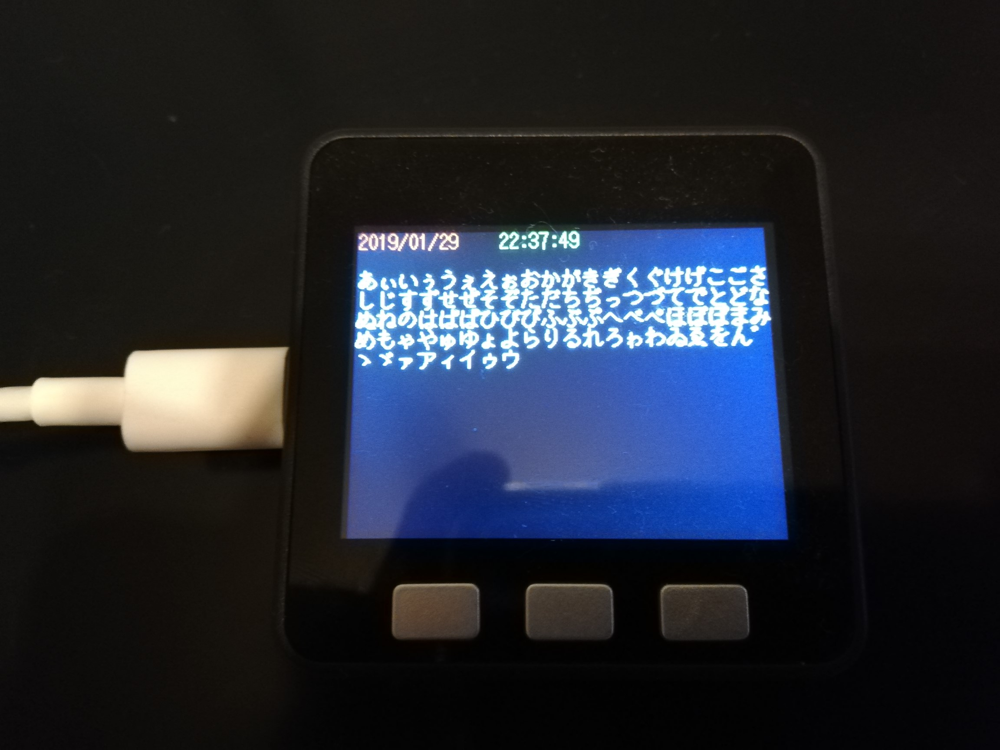

# sdfonts_py

## 概要
- M5Stack, MicroPythonでの日本語表示ライブラリです。
- [Tamakichi/Arduino-KanjiFont-Library-SD](https://github.com/Tamakichi/Arduino-KanjiFont-Library-SD)を使用
  - 上Arduino用ライブラリから関数名等を拝借していますが、作成者は別人です。
- 

## Run Sample for M5Stack
0. git clone
0. Download FONT.BIN from https://github.com/Tamakichi/Arduino-KanjiFont-Library-SD/tree/master/fontbin
0. Put files to M5Stack
```
$ alias ampy='ampy -p /dev/ttyS3 -b 115200'
$ ampy put FONT.BIN /sd/font/FONT.BIN
$ ampy put sdfonts_py/sdfonts_py.py
$ ampy put sdfonts_py/m5stack_print.py

$ ampy put sample/simple_wifi.py
$ ampy put sample/main.py

$ echo '{"wifi":{"ssid":"YOUR_SSID","password":"YOUR_PASS"}}' > config.json 
$ ampy put config.json /flash/config.json

```


## Usage
#### Basic Usage
```
from m5stack_print import M5StackPrint
import uos ## if use SD

uos.mountsd() ## if use SD

FONTPATH = '/sd/font/FONT.BIN' ## Your FONT.BIN path
m5p = M5StackPrint(FONTPATH) ## PrintWrapper
m5p.print(u"aAあア亜\n")
```

#### Options
```
m5p.font_size = 16 ## Size
m5p.font_color = 0xFFFFFF ## Font Color
m5p.back_color = 0x444444 ## BackGround Color
m5p.rect = (0, 0, 320, 240) ## Text Area Rect(StartX, StarY, Width, Height)
m5p.append = False ## Append On/Off
```

####  Usage for Append
```
m5p.append = True ## Append On/Off
m5p.clear()
m5p.print(u"a") ## Show "a"
m5p.print(u"b") ## Show "ab"
m5p.print(u"c") ## Show "abc"
```


## License
MIT.


## Memo.
- 
